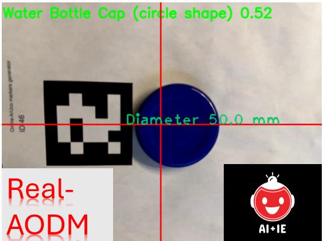

# Real-AODM: Realtime Autonomous Object Detection and Measurement System

## Overview
In here, we present Real-AODM, a Realtime Autonomous Object Detection and Measurement System. Leveraging state-of-the-art YOLOv5 for object detection and ArUco marker-based measurement techniques, Real-AODM is designed to perform real-time autonomous detection and measurement of objects using various camera devices.

This system has been trained and validated using images of specific objects such as water bottle caps, external hard drives, and steel plates. Experimental results demonstrate that Real-AODM achieves high detection accuracy and highly precise measurements, highlighting its potential for diverse industrial applications. The integration of advanced computer vision techniques makes Real-AODM a robust and efficient solution for real-time object analysis.

## Installation and Run

### Prerequisites
- Python 3.8 or higher
- Virtual environment tool (such as `venv` or `conda`)

### Steps

1. **Clone the Repository**
   git clone https://github.com/yourusername/Real-AODM-GITHUB.git      
   cd Real-AODM-GITHUB/SOFTWARE

2. **Create and Activate Virtual Environment**
   python -m venv real-aodm-env
   source real-aodm-env/bin/activate  # On Windows use `real-aodm-env\Scripts\activate`

3. **Install Requirements**
   pip install -r requirements.txt

4. **Run the Application**
   python Master.py

## Training on Your Own Images

1. **Label Your Images**
   Use a tool like Label Studio to label your images with bounding boxes
2. **Create data.yaml File**
   Ensure your data.yaml file is correctly set up with paths to your images and labels
3. **Train the Model**
   python train.py --img 640 --batch 16 --epochs 50 --data data.yaml --weights yolov5s.pt

## Contact

For more information, please contact bxp@aiplusie.com
